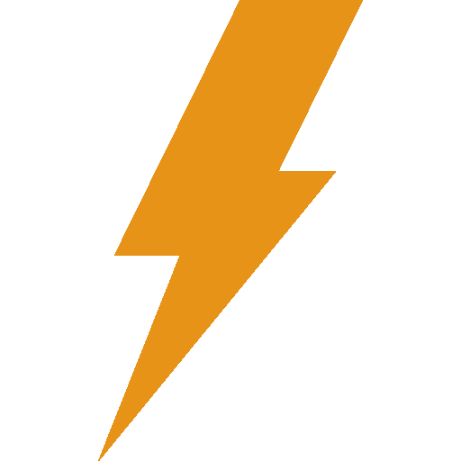
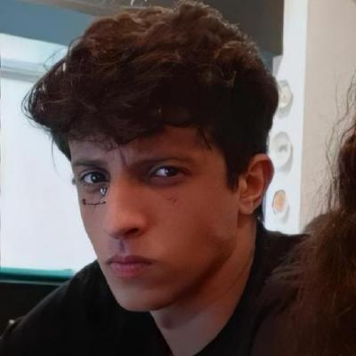

<!DOCTYPE html>
<html lang="en">

<head>
    <link rel="stylesheet" href="style.css">
    <link rel="icon" href="thunder.png">
    <title>Gabriel's Portfolio</title>

</head>

<body onload="openTab(event, 'AboutMe')">

    

    

        

            
            <h4 class="firstLogo">Perxibes</h4>
            <h4 class="secondLogo">Development </h4>
            <h6>Develop by Gabriel Przybysz Gonçalves Júnior</h6>
        

    

    

        

            <button class="tablinks linkActive" onclick="openTab(event, 'AboutMe')">About me</button>
            <button class="tablinks" onclick="openTab(event, 'Repositories')">Top 5 Repositories</button>
            <button class="tablinks" onclick="openTab(event, 'Skills')">Skills</button>
            <button class="tablinks" onclick="openTab(event, 'Contacts')">Contacts</button>
        

        

            
        

    

    

        <h1>Gabriel Przybysz</h1>
        <h3>Intern at Aquiris</h3>
        
 <svg class="icon" height="18" viewBox="0 0 16 16" version="1.1" width="18" aria-hidden="true"><path fill-rule="evenodd" d="M5.5 3.5a2 2 0 100 4 2 2 0 000-4zM2 5.5a3.5 3.5 0 115.898 2.549 5.507 5.507 0 013.034 4.084.75.75 0 11-1.482.235 4.001 4.001 0 00-7.9 0 .75.75 0 01-1.482-.236A5.507 5.507 0 013.102 8.05 3.49 3.49 0 012 5.5zM11 4a.75.75 0 100 1.5 1.5 1.5 0 01.666 2.844.75.75 0 00-.416.672v.352a.75.75 0 00.574.73c1.2.289 2.162 1.2 2.522 2.372a.75.75 0 101.434-.44 5.01 5.01 0 00-2.56-3.012A3 3 0 0011 4z"></path></svg>            Backend Developer

        
 <svg class="icon" viewBox="0 0 16 16" version="1.1" width="18" height="18" aria-hidden="true"><path fill-rule="evenodd" d="M11.536 3.464a5 5 0 010 7.072L8 14.07l-3.536-3.535a5 5 0 117.072-7.072v.001zm1.06 8.132a6.5 6.5 0 10-9.192 0l3.535 3.536a1.5 1.5 0 002.122 0l3.535-3.536zM8 9a2 2 0 100-4 2 2 0 000 4z"></path></svg>            Brasil, Rio Grande do Sul

    

    

        

            
Hi,
                 
                  From a very young age, I was fascinated by everything that involved technology, especially games. I am 17 years old. <a class="intextRef" href="https://www.linkedin.com/in/gabriel-przybysz-864b42163/">I started in the games industry at 14 years</a>                old as an apprentice selected by Aquiris Game Studio. Among my many passions are mathematics, physics, chess, and, of course, programming.
                 
                  With 3 and a half years of experience, I was able to get to know and work in different aspects of programming, but I fell in love with the backend. I had the opportunity to create several <a class="intextRef" href="https://github.com/GabrielPrzybysz?tab=repositories">projects</a>,
                from games to research on information security (which is also an area that fascinates me).
                 
                  Favorite and recommended books: Introduction to Pentest by Daniel Moreno; Black Hat Python by Justin Seitz; Winning by Jack Welch with Susy Welch. 

        

        

            

                <h2><a href="https://github.com/GabrielPrzybysz/pickYcolor">Pick Your Color (Game)</a></h2>
                
This project bright a casual game, color-based and using the unity 3d physics. Future ported to mobile ❤️

                
 C#

            

            

                <h2><a href="https://github.com/GabrielPrzybysz/Typeo">Typeo (Game)</a></h2>
                
A Unity project, made with inspiration in the Sokoban game. Completely based in a matrix, the game brings a hacker thematic of the '80s.

                
 C#

            

            

                <h2><a href="https://github.com/GabrielPrzybysz/Exploring-MS12-020">Exploring-MS12-020 (Research)</a>
                </h2>
                
.

                
 Python / Ruby

            

            

                <h2><a href="https://github.com/GabrielPrzybysz/MasterTetris">Tetris (Game)</a></h2>
                
A game inspired by Tetris. This project bright a casual game, using a matrix 10x20.

                
C#

            

            

                <h2><a href="https://github.com/GabrielPrzybysz/pickYcolor">????????</a></h2>
                
????????

                
???????? 

            

            
You can see more on my <a href="https://github.com/GabrielPrzybysz?tab=repositories">github</a>

        

        

            
   <b style="font-size: 19px;">C#</b>:
                 
                 
                  Courses (Audit only):
                  * CodeAcademy - Learn Csharp;
                  * edx - CS50's Introduction to Game Development; Object Oriented Programming in C#.
                 
                  Experience:
                  * Responsible for maintaining and supporting applications, developing features and correcting bugs.
                 
                  Projects:
                  * Typeo
                  * Pick Your Color
                  * SokobanLevelDesignTool
                  * MasterTetris
                 
                   <b style="font-size: 19px;">C</b>:
                 
                  Courses (Audit only):
                  * edx - C Programming: Pointers and Memory Management
                  * edx - C Programming: Modular Programming and Memory Management
                  * edx - C Programming: Language Foundations
                 
                   <b style="font-size: 19px;">Python3</b>:
                 
                  Courses (Audit only):
                  * CodeAcademy - Learn Python3
                  * CodeAcademy - Learn Python2
                  * Curso em Vídeo - Curso Python
                 
                  Experience:
                  * Lambdas created in AWS
                  * Responsible for maintaining and supporting applications, developing features and correcting bugs.
                 
                  Projects:
                  * SockeTacToe
                  * Exploring-MS12-020
                 
                   <b style="font-size: 19px;">HTML, CSS</b>
                 
                  Experience:
                  * I created many static personal websites.
                  * Responsible for maintaining and supporting ASP.NET MVC 5 applications, developing features and fixing bugs.
                 
                   <b style="font-size: 19px;">JavaScript</b>
                 
                   <b style="font-size: 19px;">Amazon Web Services (DynamoDB, S3, API Gateway, Lambdas, Lightsail, SQS, SES)</b>
                 
                   <b style="font-size: 19px;">SQL (MySQL)</b>
                 
                   <b style="font-size: 19px;">Docker</b>
                 
            

        

        

            

                Email: gabrielgprzy@gmail.com
                 
                  Linkedin: <a href="https://www.linkedin.com/in/gabriel-przybysz-864b42163/">Gabriel Przybysz</a>
                 
                  Contact Number: +55 (51) 98900-2659
                 
                  Github: <a href="https://github.com/GabrielPrzybysz">Gabriel Przybysz</a>
            

        

    

</body>

</html>
